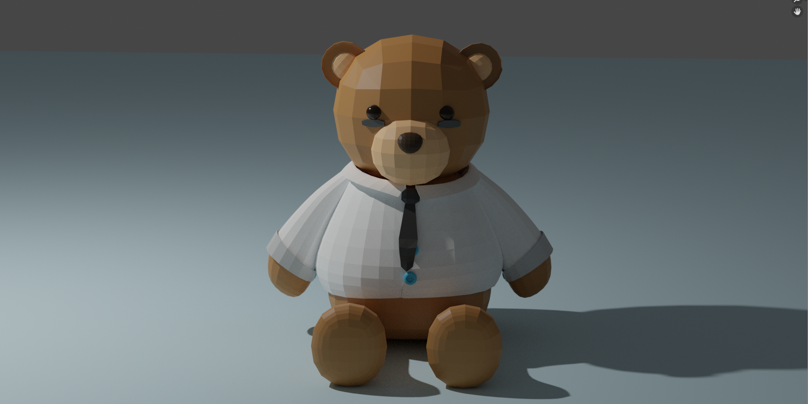
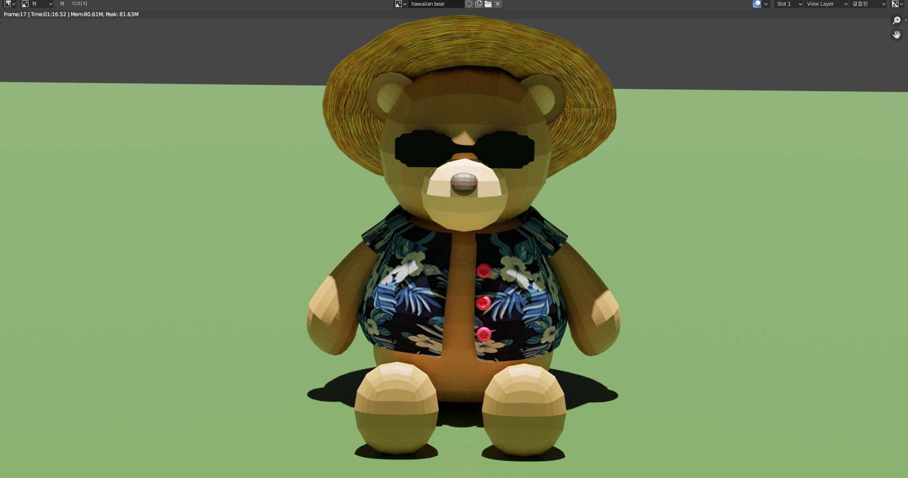
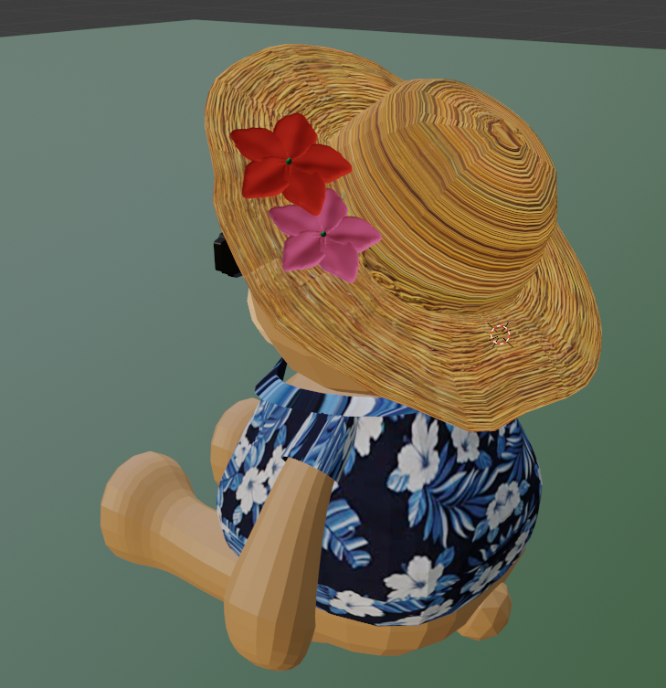

#  (2021 충북 게임잼)

## 1. 작업 의도

:blush: 2021 충북게임잼의 주제는 <현재를 즐겨라. 카르페디엠, YOLO>였습니다.

이에 야근에 지친 곰돌이 사원이 휴가를 떠나고자 회사를 탈출하는 게임을 기획하였습니다.

플래피버드, 플립보틀 게임에 착안하여 마우스 왼쪽 클릭을 통해

장애물을 피하며 게임을 진행합니다.

 

## 2. 작업 과정

   :runner: **소요 기간**: 5일 (회의 기간 포함)

   :speech_balloon: **Unity, Blender, Photoshop**으로 제작

- 팀명: 매드카우
- 팀원: 기획자 1명, 프로그래머 1명, 그래픽 1명, 사운드 1명 (총 4명)
- 파트: 모델링, 리깅, 애니메이션, 프리팹, 텍스쳐 제작, UI 등 그래픽을 맡았습니다.

## 3. 결과물 

**<u>*마우스 오른쪽 버튼 > 새 탭에서 열기 (원본 사이즈의 이미지가 열립니다.)</u>**

{: width="70%" height="70%"}

{: width="120%" height="120%"}

:thought_balloon:  블렌더와 유니티를 배워가며 만든 첫 게임입니다. 팀원들과 소통하며 구색을 갖춰 나가는 게임을 보며

뿌듯하고 재미있었습니다.  한정된 기간 안에 게임을 완성해야 해서 저에게는 쉽지 않은 도전이었지만, 

'나도 할 수 있다' 라는 자신감을 심어준 경험이었습니다.

